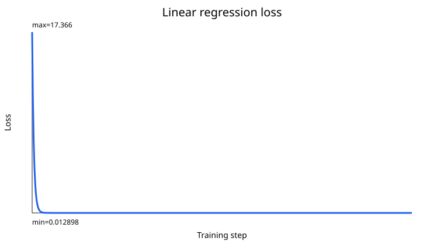

# Optimization Lab

Optimization Lab implements linear and logistic regression with NumPy so the training process is visible.

> **What this is not:** a headline ML project. It is a learning artifact for understanding gradients before using PyTorch or scikit-learn. It contains no medical data and makes no medical claim.



## Quickstart

```bash
git clone https://github.com/mghadia1/optimization-lab.git
cd optimization-lab
python3 -m venv .venv && source .venv/bin/activate
python -m pip install -e .

# run the tests (7, including the fault-injection gate)
PYTHONPATH=src python -m unittest discover -s tests -v

# run the demo (writes results.json, loss CSVs, and SVG loss plots)
PYTHONPATH=src python -m optimization_lab.cli run --out outputs/demo
```

## Headline result

All six automated tests pass. They verify the hand-derived analytic gradients against centered finite differences, confirm the loss falls on suitable synthetic data, and confirm that a deliberately excessive learning rate diverges.

A passing count proves nothing by itself, so the suite is measured against
deliberate faults. `tools/mutation_check.py` injects ten plausible arithmetic
mistakes one at a time — a dropped factor of two in a gradient, a flipped
residual sign, an intercept gradient copy-pasted from the slope, a divergence
guard that never trips, a centered finite difference divided by one step — and
runs the suite against each. **All ten are caught** (verified August 22, 2026;
`python tools/mutation_check.py`), and a seventh test makes that a CI gate
rather than a script someone remembers to run.

Two details keep the number honest: a control run with no mutation must pass
first, otherwise every fault would look "caught"; and each mutation must match
its target exactly once, so the harness errors rather than silently skipping a
fault it can no longer inject. The harness was itself checked by injecting a
cosmetic docstring edit no assertion can observe — it was correctly reported as
MISSED.

## What it demonstrates

- deterministic synthetic regression and binary-classification datasets;
- mean squared error and binary cross-entropy;
- hand-derived batch gradients;
- centered finite-difference gradient checks;
- gradient descent for linear regression;
- logistic regression with a numerically stable sigmoid;
- a deliberately excessive learning-rate experiment;
- automated tests and machine-readable experiment output.

## Learning order

1. Read `docs/how-it-works.md` beside the source.
2. Run the tests and demo.
3. Change one learning rate and predict what will happen before running it.
4. Complete the questions in `docs/learning-checklist.md` in your own words.

This repository should normally be linked from a portfolio rather than used as a headline resume project. It contains no medical data and makes no medical claim.

## Container

```bash
docker build -t optimization-lab .
docker run --rm optimization-lab
```

The container runs the deterministic NumPy experiment and prints the fitted parameters and losses. The image was built and smoke-tested locally on July 21, 2026.
